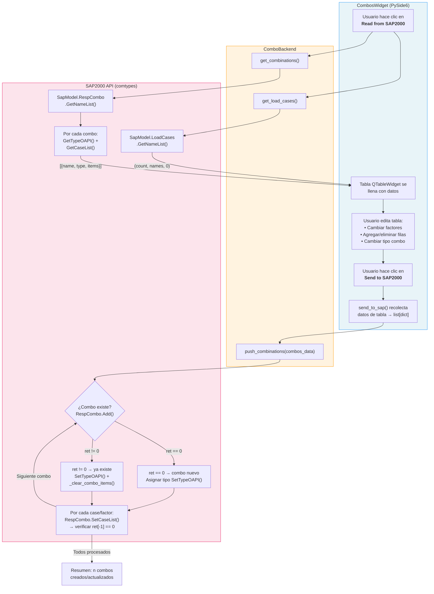

# Combinaciones de Carga

Módulo para lectura, edición matricial y escritura de **Load Combinations** en SAP2000 mediante una interfaz tipo spreadsheet.

## Descripción

Permite extraer todas las combinaciones de carga definidas en un modelo SAP2000 abierto, presentarlas en una tabla editable (filas = combos, columnas = load cases, celdas = scale factors), y empujar los cambios de vuelta al modelo. Soporta los tipos: Linear Add, Envelope, Absolute Add, SRSS y Range Add.

## Arquitectura

| Archivo | Clase | Responsabilidad |
|---|---|---|
| `combos_backend.py` | `ComboBackend` | Lógica pura contra `SapModel` — lectura y escritura de combos vía API `RespCombo` |
| `app_combos_gui.py` | `CombosWidget` | Widget `QWidget` con `QTableWidget` dinámica, toolbar y lógica de presentación |

La inyección de dependencias sigue el patrón estándar del proyecto:

```python
# Backend recibe sap_model directamente
backend = ComboBackend(sap_interface.SapModel)

# GUI recibe sap_interface y crea el backend bajo demanda
widget = CombosWidget(parent, sap_interface=sap_interface)
```

## Diagrama de Procedimiento



### Detalle del flujo

1. **Lectura** — `get_load_cases()` obtiene los nombres de Load Cases para crear las columnas. `get_combinations()` itera sobre cada combo existente extrayendo su tipo (`GetTypeOAPI`) y los factores por caso (`GetCaseList`).
2. **Edición** — La tabla permite modificar scale factors, cambiar el tipo de combo vía `QComboBox`, y agregar/eliminar filas.
3. **Escritura** — `push_combinations()` intenta `RespCombo.Add()` para cada combo; si ya existe (ret ≠ 0), actualiza tipo y limpia items existentes con `DeleteCase()`, luego agrega cada case/factor con `SetCaseList()`.

## Uso en la GUI

La pestaña **"Combinaciones de Carga"** en `main_app.py` presenta:

- **Toolbar**: Read from SAP · Send to SAP · Add Row · Delete Row
- **Tabla**: Columnas dinámicas según Load Cases del modelo

## Ejecución Standalone

```bash
# GUI independiente (conecta vía GetActiveObject)
python Combinations_Carga/app_combos_gui.py

# Backend aislado (pruebas)
python Combinations_Carga/combos_backend.py
```

## Dependencias

- `comtypes` (indirecta vía `sap_model`)
- `PySide6` (GUI)

## Infraestructura Utilizada

- **StyledButton** — Botones con variantes (primary para leer, success para enviar)
- **LogWidget** — Log de operaciones con timestamp
- **check_ret_code** — Validación de retornos API SAP2000
- **AppLogger** — Logging en backend

## Ejecutar Standalone

```bash
python -m Combinations_Carga.app_combos_gui
```
