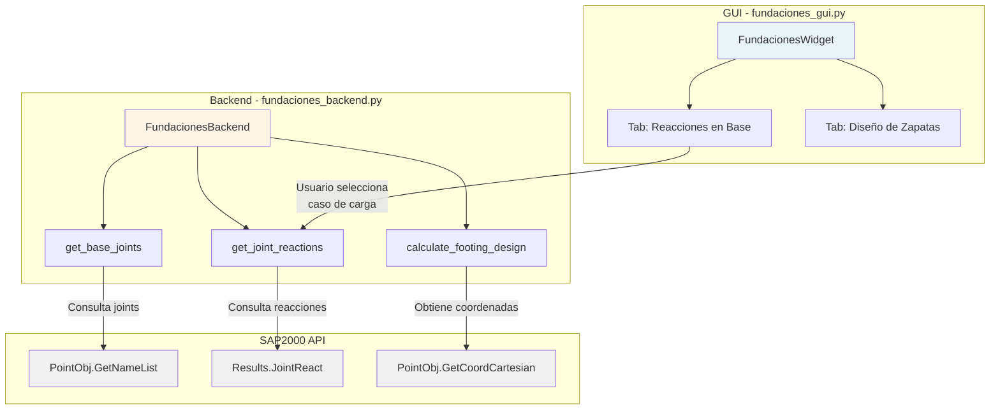

# Módulo de Fundaciones

Análisis y diseño de fundaciones basado en los resultados de SAP2000.

## Descripción

Este módulo permite:
- Analizar reacciones en la base del modelo
- Identificar puntos de apoyo y cargas de fundación
- Diseñar zapatas aisladas y combinadas (próximamente)
- Generar reportes de diseño de fundaciones (próximamente)

## Arquitectura

| Archivo | Clase | Responsabilidad |
|---|---|---|
| `fundaciones_backend.py` | `FundacionesBackend` | Extracción de reacciones, cálculos de diseño, procesamiento de datos SAP2000 |
| `fundaciones_gui.py` | `FundacionesWidget` | Interfaz principal con tabs para reacciones y diseño |

## Diagrama de Procedimiento



## Uso

### Desde la Aplicación Principal

1. Abrir `main_app.py`
2. Conectar a SAP2000 usando el botón "🔌 Conectar"
3. Seleccionar la pestaña "Fundaciones"
4. En la sub-pestaña "Reacciones en Base":
   - Actualizar lista de casos de carga
   - Seleccionar caso de carga deseado
   - Obtener reacciones

### Ejecución Standalone

Para probar el módulo de forma independiente:

```bash
# Backend
python Fundaciones/fundaciones_backend.py

# GUI
python -m Fundaciones.fundaciones_gui
```

## Funcionalidades Actuales

✅ **Implementado:**
- Estructura base del módulo
- Interfaz con pestañas
- Obtención de lista de joints
- Conexión con SAP2000

🚧 **En desarrollo:**
- Cálculo de reacciones en base
- Filtrado de joints por elevación
- Diseño de zapatas aisladas
- Diseño de zapatas combinadas
- Generación de reportes

## Notas Técnicas

### Manejo de Retornos de comtypes

Recordar que las funciones de SAP2000 API retornan tuplas donde el último elemento es el código de retorno:

```python
ret = SapModel.PointObj.GetNameList()
# ret = (count, names_tuple, RetCode)
if ret[-1] == 0:  # Éxito
    count = ret[0]
    names = ret[1]
```

### Inyección de Dependencias

El backend recibe `sap_model` en el constructor, permitiendo:
- Inyección desde `sap_interface` en modo integrado
- Conexión vía `GetActiveObject` en modo standalone
- Tests con `sap_model=None`

```python
# Modo integrado
backend = FundacionesBackend(sap_interface.SapModel)

# Modo standalone
backend = FundacionesBackend()  # Debe conectar internamente si es necesario
```

## Próximas Mejoras

1. Implementar `get_joint_reactions()` usando `Results.JointReact`
2. Filtrar joints por cota Z (identificar base del modelo)
3. Calcular dimensiones preliminares de zapatas
4. Integración con módulo de Reportes para generar memorias
5. Exportar resultados a Excel
6. Visualización gráfica de distribución de cargas

## Infraestructura Utilizada

- **StyledButton** — Botones de acción (primary, secondary)
- **LogWidget** — Log de operaciones con timestamp
- **check_ret_code** — Validación de retornos API SAP2000
- **AppLogger** — Logging en backend

## Ejecutar Standalone

```bash
python -m Fundaciones.fundaciones_gui
```
