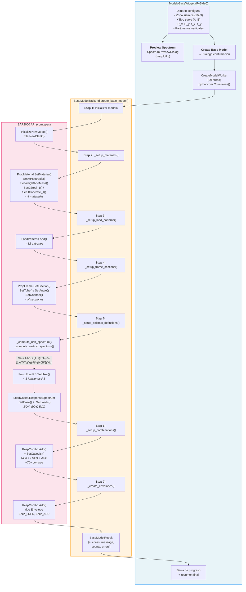

# Modelo Base

Módulo para crear un modelo SAP2000 en blanco preconfigurado con parámetros de la norma sísmica chilena **/ NCh2369**, materiales estándar, load patterns, secciones de marco, espectros de respuesta y combinaciones de diseño LRFD/ASD.

## Descripción

Automatiza los ~200+ pasos repetitivos de configuración inicial de un modelo estructural de acero. En un solo clic genera:

- **4 materiales** (A36, A500 Gr.B, G30, G25) con propiedades completas
- **12 load patterns** (DEAD, LIVE, ROOF, SNOW, EQ X/Y/Z, WIND X/Y, TEMP, SO, SA)
- **Secciones frame** (W shapes, HSS tubes, ángulos, canales)
- **Espectros NCh** horizontales (X, Y) y vertical (Z) con fórmula normativa
- **~70+ combinaciones** NCh (E1, E2, E3) + LRFD + ASD con variantes de temperatura
- **Envolventes** ENV_LRFD y ENV_ASD

## Arquitectura

| Archivo | Clase | Responsabilidad |
|---|---|---|
| `config.py` | `SoilParameters`, constantes | Parámetros normativos NCh: suelos A–E, zonas sísmicas, materiales, combos, secciones |
| `modelo_base_backend.py` | `BaseModelBackend` | Orquestación de 7 etapas de creación vía API SAP2000 |
| `modelo_base_backend.py` | `BaseModelResult` | Dataclass con resultado: success, message, conteos, errores |
| `app_modelo_base_gui.py` | `ModeloBaseWidget` | Formulario de entrada (zona, suelo, R, ξ) + botón crear |
| `app_modelo_base_gui.py` | `SpectrumPreviewDialog` | Diálogo matplotlib con gráficos de espectros H/V |
| `app_modelo_base_gui.py` | `CreateModelWorker` | `QThread` para ejecución COM en hilo separado (`pythoncom.CoInitialize`) |

## Diagrama de Procedimiento



### Detalle de las 7 etapas

| Etapa | Método | Descripción |
|---|---|---|
| 1 | `InitializeNewModel` + `NewBlank` | Crea modelo vacío en SAP2000 |
| 2 | `_setup_materials()` | A36, A500 Gr.B (acero), G30, G25 (hormigón) con E, ν, ρ, Fy/f'c |
| 3 | `_setup_load_patterns()` | 12 patrones estándar con tipo (Dead, Live, Quake, Wind, etc.) |
| 4 | `_setup_frame_sections()` | Perfiles W, HSS, ángulos y canales predefinidos |
| 5 | `_setup_seismic_definitions()` | Espectros NCh horizontales y vertical → funciones RS → load cases RS con CQC |
| 6 | `_setup_combinations()` | NCh (E1–E3 con 100/30/30%), LRFD (21 base × temp), ASD (25 base × temp) |
| 7 | `_create_envelopes()` | Envolventes finales ENV_LRFD y ENV_ASD |

### Fórmula espectral NCh2369:2025

$$S_a = \frac{I \cdot A_r \cdot S \cdot \left(1 + r\left(\frac{T}{T_0}\right)^p\right)}{\left(1 + \left(\frac{T}{T_0}\right)^q\right) \cdot R^*} \cdot \left(\frac{0.05}{\xi}\right)^{0.4}$$

El espectro vertical aplica un factor de 0.7 y un desplazamiento de período ×1.7.

## Uso en la GUI

La pestaña **"Modelo Base"** en `main_app.py` presenta:

1. **Formulario** — Zona sísmica, tipo de suelo, factores R, amortiguamientos ξ, parámetros verticales
2. **Preview Spectrum** — Diálogo con gráficos matplotlib mostrando espectros H(X), H(Y) y V + tabla de valores
3. **Create Base Model** — Confirmar → barra de progreso → resumen con conteo de elementos creados

> ⚠️ **Advertencia**: Crear un modelo base reemplaza completamente el modelo activo en SAP2000.

## Ejecución Standalone

Este módulo **no tiene** bloque `if __name__ == "__main__"` — solo es accesible vía la aplicación principal:

```bash
python main_app.py
# → Pestaña "Modelo Base"
```

## Dependencias

- `comtypes` (API SAP2000)
- `PySide6` (GUI)
- `pythoncom` (inicialización COM en thread)
- `matplotlib` + `numpy` (preview de espectros, opcional)
- `math`, `dataclasses` (cálculos y estructuras)
