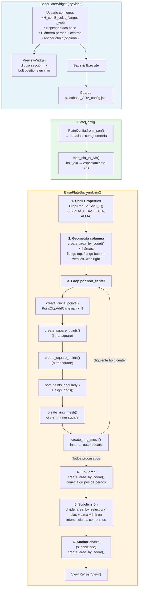

# Placa Base

Módulo para la generación automatizada de geometría FEA de **placas base** en SAP2000 — crea shell elements para la placa, alas y alma de columna, anillos de pernos (transición círculo → cuadrado) y opcionalmente anchor chairs.

## Descripción

A partir de las dimensiones de una columna tipo I, parámetros de la placa y coordenadas de pernos, el módulo genera automáticamente en SAP2000:

- **Propiedades de área** shell (PLACA_BASE, ALA, ALMA)
- **Geometría de columna** (alas superior/inferior + alma) como áreas de 4 puntos
- **Anillos de pernos** por cada centro de bolt: puntos en círculo → cuadrado interior → cuadrado exterior → ring meshes conectando las capas
- **Área de enlace** (link area) conectando los grupos de pernos
- **Subdivisión** de alas, alma y link area en los puntos de intersección con pernos
- **Anchor chairs** opcionales

## Arquitectura

| Archivo | Clase | Responsabilidad |
|---|---|---|
| `placabase_backend.py` | `PlateConfig` | Dataclass con geometría completa (bolts, columna, placa, anchor). `from_json()` carga desde JSON |
| `placabase_backend.py` | `BasePlateBackend` | Lógica de generación: crea puntos, áreas, ring meshes y subdivisiones vía API SAP2000 |
| `app_placabase_gui.py` | `BasePlateWidget` | Formulario con 5 grupos de inputs + log de salida |
| `app_placabase_gui.py` | `PreviewWidget` | Canvas custom (`paintEvent`) — dibuja sección I, bolt positions y contorno A×A |
| `placabase_ARA_config.json` | — | Configuración persistida (dimensiones, centros de pernos) |

> 📄 Para el detalle de bajo nivel de cada llamada COM, ver [docs/placabase_ARA_flow.md](docs/placabase_ARA_flow.md).

## Diagrama de Procedimiento



### Detalle del flujo

| Paso | Acción | API SAP2000 |
|---|---|---|
| 1 | Crear propiedades shell con espesores diferentes | `PropArea.SetShell_1()` |
| 2 | Crear 4 áreas rectangulares para alas y alma | `AreaObj.AddByCoord()` |
| 3a | Generar N puntos equidistantes sobre círculo del perno | `PointObj.AddCartesian()` |
| 3b–c | Generar puntos de cuadrado interior y exterior | `PointObj.AddCartesian()` |
| 3d | Ordenar angularmente y alinear anillos | Lógica geométrica Python |
| 3e–f | Crear paneles de transición entre anillos consecutivos | `AreaObj.AddByPoint()` |
| 4 | Crear área rectangular que conecta bolt groups | `AreaObj.AddByCoord()` |
| 5 | Subdividir áreas existentes por puntos de perno | `EditArea.Divide()` con selección |
| 6 | Placas anchor chair (opcional) | `AreaObj.AddByCoord()` |

### Preset de posiciones de pernos

El widget incluye un generador automático (`generate_preset_positions()`) que calcula coordenadas de centros de pernos según:
- Número de pernos por fila
- Dimensiones de la columna (H, B)
- Espaciamientos predefinidos por diámetro de perno

## Uso en la GUI

La pestaña **"Diseño Placa Base"** en `main_app.py` presenta:

1. **Column Profile** — H, B, espesores de ala y alma
2. **Base Plate** — Espesor de la placa
3. **Bolts** — Diámetro (ComboBox), tabla manual de centros X/Y, o generador preset
4. **Anchor Chair** — Toggle + dimensiones (opcional)
5. **Output Log** — Mensajes de ejecución
6. **Preview** — Visualización en vivo del layout

## Ejecución Standalone

```bash
# Backend (requiere SAP2000 activo + placabase_ARA_config.json)
python Placa_Base/placabase_backend.py

# GUI independiente
python Placa_Base/app_placabase_gui.py
```

## Dependencias

- `comtypes` (API SAP2000)
- `PySide6` (GUI)
- `json` (configuración)
- `math` (geometría)
