# Placa Base

Módulo para la generación automatizada de geometría FEA de **placas base** en SAP2000 — crea shell elements para la placa, alas y alma de columna, anillos de pernos (transición círculo → cuadrado interior → cuadrado exterior) y opcionalmente anchor chairs con su propia geometría de anillos.

## Descripción

A partir de las dimensiones de una columna tipo I, parámetros de la placa y coordenadas de pernos, el módulo genera automáticamente en SAP2000:

- **Propiedades de área** shell: `PLACA_BASE`, `ALA`, `ALMA` (y `ChairPlate` si hay silla)
- **Sección Frame circular** sólida para pernos de anclaje (ej: `BOLT_25`)
- **Geometría de columna** — 3 áreas: ala superior (`COL_FLANGE_TOP`), ala inferior (`COL_FLANGE_BOTTOM`) y alma (`COL_WEB`), con altura de columna = 2×H_col
- **Anillos de pernos** por cada centro de bolt: 16 puntos en círculo → 16 puntos en cuadrado interior → 16 puntos en cuadrado exterior → 2 ring meshes conectando las 3 capas
- **Pernos Frame** — elemento Frame circular sólido (longitud = 8 × diámetro):
  - **Con silla de anclaje**: 2 tramos (silla→placa + placa→fundación), Body en silla (6 DOF) y Body en placa (UZ libre)
  - **Sin silla**: 1 tramo (placa→fundación), Body (6 DOF)
- **Apoyo Pin** en el nodo inferior de cada perno (UX, UY, UZ fijos / RX, RY, RZ libres)
- **Área de enlace** (`A_outer_link`) conectando los grupos de bolt squares exteriores, dividida en 4×n_pernos subdivisiones
- **Área de enlace silla** (`A_chair_link`) — réplica del link area a la cota de la silla (solo con anchor chair)
- **Puntos de columna a cota silla** — 6 puntos en bordes de alas y alma a `z = anchor_chair_height` para compatibilidad de mesh
- **Subdivisión** de alas, alma, link area y chair link area usando puntos seleccionados por coordenadas (`MeshType=3`) + subdivisión 1×2
- **TC Limits** (compresión = 0) en todos los Frames de pernos — pernos solo resisten tracción
- **Módulo de balasto** (resorte de compresión en cara inferior) asignado a todas las áreas en z=0, con cambio temporal de unidades a `kgf_cm_C`

## Arquitectura

| Archivo | Clase | Responsabilidad |
|---|---|---|
| `placabase_backend.py` | `PlateConfig` | Dataclass con geometría completa (bolts, columna, placa, anchor, material perno). `from_json()` carga desde JSON. `map_dia_to_AB()` mapea diámetro → espaciamiento A/B |
| `placabase_backend.py` | `BasePlateBackend` | Lógica de generación: crea puntos, áreas, ring meshes, pernos Frame, Body constraints, Pin restraints, subdivisiones, TC Limits y balasto vía API SAP2000 |
| `app_placabase_gui.py` | `BasePlateWidget` | Formulario con 6 grupos de inputs + log de salida. Carga materiales del modelo SAP2000 al conectar. `build_config()` construye `PlateConfig` desde el formulario |
| `app_placabase_gui.py` | `PreviewWidget` | Canvas custom (`paintEvent`) — dibuja sección I con espesores reales, bolt positions y contorno B×B por cada perno |
| `placabase_ARA_config.json` | — | Configuración persistida (dimensiones, centros de pernos) |

> 📄 Para el detalle de bajo nivel de cada llamada COM, ver [docs/placabase_ARA_flow.md](docs/placabase_ARA_flow.md).

## Diagrama de Procedimiento

```mermaid
flowchart TD
    subgraph GUI["BasePlateWidget (PySide6)"]
        A["Usuario configura:<br/>• H_col, B_col, t_flange, t_web<br/>• Espesor placa base<br/>• Diámetro pernos + centros<br/>• Material perno (ComboBox desde modelo)<br/>• Anchor chair (opcional)<br/>• Módulo balasto ks"]
        A2["PreviewWidget<br/>dibuja sección I con<br/>espesores reales +<br/>bolt positions + B×B"]
        A3["<b>🚀 Ejecutar</b><br/>build_config() → PlateConfig"]
    end

    subgraph Config["PlateConfig"]
        C1["PlateConfig(dataclass)<br/>bolt_dia, H_col, B_col, n_pernos,<br/>bolt_centers, espesores, ks_balasto,<br/>include_anchor_chair, bolt_material"]
        C2["map_dia_to_AB()<br/>bolt_dia → (A, B) spacing"]
    end

    subgraph Backend["BasePlateBackend.run()"]
        P1["<b>1. Shell Properties</b><br/>PropArea.SetShell_1()<br/>× 3: PLACA_BASE, ALA, ALMA<br/>+ ChairPlate si anchor chair"]
        P1B["<b>1b. Bolt Section</b><br/>PropFrame.SetCircle()<br/>BOLT_{dia} con bolt_material"]
        P2["<b>2. Geometría columna</b><br/>AreaObj.AddByCoord()<br/>× 3: COL_FLANGE_TOP,<br/>COL_FLANGE_BOTTOM, COL_WEB<br/>altura = 2×H_col"]
        P3["<b>3. Loop por bolt_center</b>"]
        P3A["CENTER_{idx} + 16 pts círculo<br/>+ 16 pts cuadrado interior<br/>+ 16 pts cuadrado exterior"]
        P3E["create_ring_mesh() × 2<br/>(círculo→inner_sq, inner_sq→outer_sq)"]
        P3CHAIR{"¿Silla de anclaje?"}
        P3YES["<b>CON SILLA</b><br/>① create_single_chair() a z=chair_h<br/>  (centro + 3 anillos + 2 ring meshes)<br/>② Frame silla→placa (BOLT_CHAIR_FRAME)<br/>③ Frame placa→fundación (L=8d)<br/>④ Body silla: 6 DOF restringidos<br/>⑤ Body placa: UZ libre<br/>⑥ Pin en nodo inferior"]
        P3NO["<b>SIN SILLA</b><br/>① Frame placa→fundación (L=8d)<br/>② Body: 6 DOF restringidos<br/>③ Pin en nodo inferior"]
        P4["<b>4a. Link area (A_outer_link)</b><br/>AreaObj.AddByPoint() con 4 esquinas<br/>de outer squares + Divide grid 4n×10"]
        P4B["<b>4b. Chair link (A_chair_link)</b><br/>(solo con silla) — misma lógica<br/>a cota z=anchor_chair_height"]
        P4C["<b>4c. Puntos columna a cota silla</b><br/>6 pts en bordes de alas y alma<br/>para compatibilidad de mesh"]
        P5["<b>5. Subdivisión por selección</b><br/>Para cada elemento:<br/>ClearSelection → CoordinateRange<br/>→ Divide MeshType=3<br/>→ subdivide_areas 1×2"]
        P5D["Elementos subdivididos:<br/>• COL_FLANGE_TOP<br/>• COL_FLANGE_BOTTOM<br/>• COL_WEB<br/>• A_outer_link<br/>• A_chair_link (si silla)"]
        P6["<b>6. TC Limits</b><br/>FrameObj.SetTCLimits()<br/>Compresión=0 en todos los<br/>frames de pernos"]
        P7B["<b>7. Balasto</b><br/>SetPresentUnits(kgf_cm_C)<br/>→ CoordinateRange z=0<br/>→ AreaObj.SetSpring(ItemType=2)<br/>→ restaurar unidades"]
        P8["View.RefreshView()<br/>View.RefreshWindow()"]
    end

    A --> A2
    A --> A3 --> C1
    C1 --> C2 --> P1

    P1 --> P1B --> P2 --> P3
    P3 --> P3A --> P3E --> P3CHAIR
    P3CHAIR -->|"✅ Sí"| P3YES
    P3CHAIR -->|"❌ No"| P3NO
    P3YES -->|"Siguiente bolt"| P3
    P3NO -->|"Siguiente bolt"| P3
    P3YES -->|"Todos procesados"| P4
    P3NO -->|"Todos procesados"| P4
    P4 --> P4B --> P4C --> P5
    P5 --> P5D --> P6 --> P7B --> P8

    style GUI fill:#e8f4f8,stroke:#2196F3
    style Config fill:#e8f5e9,stroke:#4CAF50
    style Backend fill:#fff3e0,stroke:#FF9800
```



### Detalle del flujo de modelado

| Paso | Acción | API SAP2000 | Detalle |
|---|---|---|---|
| 1 | Crear propiedades shell (3 o 4) | `PropArea.SetShell_1()` (fallback `SetShell()`) | `PLACA_BASE` (plate_thickness), `ALA` (flange_thickness), `ALMA` (web_thickness), `ChairPlate` (anchor_chair_thickness) si aplica |
| 1b | Crear sección Frame circular sólida | `PropFrame.SetCircle(BOLT_{dia}, bolt_material, dia)` | Material configurable desde ComboBox (lee materiales existentes del modelo) |
| 2 | Crear 3 áreas para alas y alma | `AreaObj.AddByCoord()` × 3 | `COL_FLANGE_TOP` en y=+H/2, `COL_FLANGE_BOTTOM` en y=−H/2, `COL_WEB` en x=0. Todas desde z=0 hasta z=2H |
| 3a | Crear punto centro + 48 puntos por perno | `PointObj.AddCartesian()` × 49 | 1 centro + 16 en círculo (r=bolt_dia/2) + 16 en cuadrado interior + 16 en cuadrado exterior (lado=B) |
| 3b | Crear 2 ring meshes por perno | `AreaObj.AddByPoint()` × 32 | Anillo interno (círculo→sq_interior) + Anillo externo (sq_interior→sq_exterior), 16 quads cada uno |
| 3c | **Con silla**: geometría de silla | `create_single_chair()` | Centro + 3 anillos (16 pts c/u) + 2 ring meshes a z=anchor_chair_height, con propiedad `ChairPlate` |
| 3d | **Con silla**: Frame tramo superior | `FrameObj.AddByPoint(chair_center, plate_center)` | `BOLT_CHAIR_FRAME_{idx}` — perno de silla a placa |
| 3e | Frame tramo principal (L=8d) | `FrameObj.AddByPoint(center, bottom)` | `BOLT_FRAME_{idx}` — desde placa (z=0) hasta z=−8×diámetro |
| 3f | Body Constraint en silla | `ConstraintDef.SetBody()` + `PointObj.SetConstraint()` | `BOLT_BODY_CHAIR_{idx}`: 6 DOF restringidos [1,1,1,1,1,1]. Aplica a centro_silla + 16 pts círculo silla |
| 3g | Body Constraint en placa | `ConstraintDef.SetBody()` + `PointObj.SetConstraint()` | **Con silla**: `BOLT_BODY_{idx}` [1,1,**0**,1,1,1] (UZ libre). **Sin silla**: [1,1,1,1,1,1] (todos restringidos). Aplica a centro_placa + 16 pts círculo placa |
| 3h | Apoyo Pin en nodo inferior | `PointObj.SetRestraint([T,T,T,F,F,F])` | Nodo a z=−8d: fijo en traslaciones, libre en rotaciones |
| 4a | Área de enlace `A_outer_link` | `AreaObj.AddByPoint()` + `EditArea.Divide(MeshType=1)` | Conecta esquinas TL/TR/BR/BL de outer squares de 4 bolt groups. Grid de (4×n_pernos) × 10 |
| 4b | Área de enlace silla `A_chair_link` | `AreaObj.AddByPoint()` + `EditArea.Divide(MeshType=1)` | Solo con anchor chair. Misma lógica que 4a pero usando puntos de silla |
| 4c | Puntos de columna a cota silla | `PointObj.AddCartesian()` × 6 | `COL_FT_CHAIR_L/R`, `COL_FB_CHAIR_L/R`, `COL_WEB_CHAIR_T/B` a z=anchor_chair_height |
| 5 | Subdivisión de áreas por selección | `SelectObj.ClearSelection()` → `SelectObj.CoordinateRange()` → `EditArea.Divide(MeshType=3)` → `EditArea.Divide(MeshType=1, 1, 2)` | Para cada elemento (flanges, web, link areas): seleccionar puntos en el plano correspondiente (z=0 y z=chair si aplica), dividir por selección, luego subdividir 1×2 |
| 6 | TC Limits en pernos | `FrameObj.SetTCLimits(LimitCompressionExists=True, LimitCompression=0)` | Todos los frames de pernos (incluyendo tramos de silla). Pernos solo resisten tracción |
| 7 | Módulo de balasto | `SetPresentUnits(14)` → `SelectObj.CoordinateRange(z=0)` → `AreaObj.SetSpring(ks, Face=-1, ItemType=2)` → restaurar unidades | Resorte solo-compresión en cara inferior de todas las áreas en z=0. Unidades temporalmente en kgf/cm³ |
| 8 | Refrescar vista | `View.RefreshView(0, False)` + `View.RefreshWindow()` | — |

### Lógica de subdivisión (Paso 5 — detalle)

El paso 5 ejecuta un patrón repetitivo para cada elemento a subdividir:

1. `ClearSelection()` — limpia selección previa
2. `CoordinateRange()` — selecciona puntos en el plano del elemento a z=0 (y a z=anchor_chair_height si hay silla, acumulando selección)
3. `divide_area_by_selection()` — divide el área usando `EditArea.Divide(MeshType=3)` que corta por los puntos seleccionados en los bordes
4. `subdivide_areas()` — cada sub-área resultante se subdivide en grilla 1×2 con `EditArea.Divide(MeshType=1)`

Elementos subdivididos y sus criterios de selección de puntos:

| Elemento | Rango X | Rango Y | Rango Z |
|---|---|---|---|
| `COL_FLANGE_TOP` | [−B/2, B/2] | [H/2, H/2] | 0 (+ chair_h) |
| `COL_FLANGE_BOTTOM` | [−B/2, B/2] | [−H/2, −H/2] | 0 (+ chair_h) |
| `A_outer_link` | [−A×n/2, A×n/2] | [H/2, H/2] | 0 |
| `A_chair_link` | [−A×n/2, A×n/2] | [H/2, H/2] | chair_h |
| `COL_WEB` | [0, 0] | [−H/2, H/2] | 0 (+ chair_h) |

### Geometría del anillo de perno

Cada bolt center genera 3 capas concéntricas de 16 puntos:
- **Círculo** — radio = `bolt_dia / 2`, 16 puntos en sentido horario
- **Cuadrado interior** — lado = `(circle_radius + outer_half) / 2 × 2`, geometría de transición
- **Cuadrado exterior** — lado = `B` (de `map_dia_to_AB(bolt_dia)`), borde exterior del bolt area

Los puntos del cuadrado se generan equiespaciados en el perímetro, empezando desde el punto medio del borde derecho y avanzando en sentido horario.

### Preset de posiciones de pernos

El widget incluye un generador automático (`generate_preset_positions()`) que calcula coordenadas de centros de pernos según:
- Número de pernos por fila (2, 3, 4 o 5)
- Dimensiones de la columna (H, B)
- Espaciamiento A del diámetro seleccionado
- 2 filas a y = ±(H/2 + B/2), con X equiespaciados centrados en 0

## Configuración JSON

El archivo `placabase_ARA_config.json` almacena:

| Campo | Tipo | Descripción |
|---|---|---|
| `bolt_dia` | `float` | Diámetro del perno (mm) |
| `bolt_material` | `string` | Nombre del material para la sección Frame del perno (debe existir en el modelo SAP2000) |
| `H_col`, `B_col` | `float` | Dimensiones de la columna |
| `n_pernos` | `int` | Pernos por fila (para preset) |
| `bolt_centers` | `list` | Coordenadas `[x, y, z]` de cada centro |
| `flange_thickness`, `web_thickness`, `plate_thickness` | `float?` | Espesores (mm) |
| `ks_balasto` | `float?` | Módulo de balasto [kgf/cm³] (vacío = sin springs) |
| `include_anchor_chair` | `bool` | Toggle para silla de anclaje |
| `anchor_chair_height`, `anchor_chair_thickness` | `float?` | Dimensiones de la silla |

Si `bolt_centers` está vacío o ausente en el JSON, se generan 8 centros por defecto (4 arriba, 4 abajo) usando `map_dia_to_AB()` y `H_col`.

## Uso en la GUI

La pestaña **"Diseño Placa Base"** en `main_app.py` presenta:

1. **Perfil Columna** — H_col, B_col, espesor ala (auto-estimado 0.12×H), espesor alma (auto-estimado 0.08×B)
2. **Placa Base** — Espesor de la placa (auto-estimado 0.06×B)
3. **Configuración de Pernos** — Diámetro (ComboBox mm/pulgadas), A/B display (read-only), tabla manual de centros X/Y/Z, generador preset (2–5 por fila), material perno (ComboBox editable, se llena desde modelo SAP2000)
4. **Silla de Anclaje** — CheckBox toggle + altura y espesor (mm)
5. **Propiedades Adicionales** — Módulo de balasto ks (kgf/cm³)
6. **Calcular** — Botón "🚀 Ejecutar" (habilitado solo con conexión SAP2000)
7. **Log de Operaciones** — LogWidget con mensajes de ejecución
8. **Preview** — Visualización en vivo del layout (sección I con espesores reales + bolt positions + cuadrado B×B por perno)

### Flujo GUI → Backend

1. `run_script()` llama a `build_config()` → construye `PlateConfig` desde todos los campos del formulario
2. Refresca materiales desde SAP2000 (`load_materials_from_model()` → `PropMaterial.GetNameList()`)
3. Instancia `BasePlateBackend(sap_model, logger=log_message)` y asigna `backend.config = cfg`
4. Llama a `backend.run_process()` → `apply_config()` → `run()`

## Ejecución Standalone

```bash
# Backend (requiere SAP2000 activo + placabase_ARA_config.json)
python Placa_Base/placabase_backend.py

# GUI independiente
python -m Placa_Base.app_placabase_gui
```

## Infraestructura Utilizada

- **StyledButton** — Botón "🚀 Ejecutar" (success), "➕/➖" filas (secondary), "Generar posiciones" (secondary)
- **LogWidget** — Log de ejecución con timestamp y auto-scroll
- **check_ret_code** — Validación de retornos API SAP2000 (de `sap_utils_common`)
- **AppLogger** — Logging en backend (fallback a `print`)
- **COLORS** — Paleta de temas (importado pero no usado directamente en layout)

## Dependencias

- `comtypes` (API SAP2000)
- `PySide6` (GUI)
- `json` (configuración)
- `math` (geometría circular y cuadrada)
