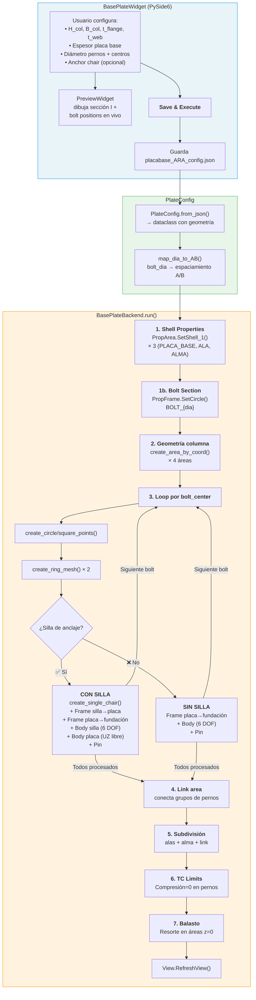

# Placa Base

Módulo para la generación automatizada de geometría FEA de **placas base** en SAP2000 — crea shell elements para la placa, alas y alma de columna, anillos de pernos (transición círculo → cuadrado) y opcionalmente anchor chairs.

## Descripción

A partir de las dimensiones de una columna tipo I, parámetros de la placa y coordenadas de pernos, el módulo genera automáticamente en SAP2000:

- **Propiedades de área** shell (PLACA_BASE, ALA, ALMA)
- **Sección Frame circular** para pernos de anclaje (ej: `BOLT_19`)
- **Geometría de columna** (alas superior/inferior + alma) como áreas de 4 puntos
- **Anillos de pernos** por cada centro de bolt: puntos en círculo → cuadrado interior → cuadrado exterior → ring meshes conectando las capas
- **Pernos Frame** — elemento Frame circular sólido desde cada centro hacia abajo (longitud = 8×diámetro)
- **Con silla de anclaje**: perno de 2 tramos (silla→placa + placa→fundación), con Body en silla (6 DOF) y Body en placa (UZ libre)
- **Sin silla**: perno de 1 tramo (placa→fundación, Body 6 DOF)
- **Apoyo Pin** en el nodo inferior de cada perno (fijo UX/UY/UZ, libre RX/RY/RZ)
- **Área de enlace** (link area) conectando los grupos de pernos
- **Subdivisión** de alas, alma y link area en los puntos de intersección con pernos
- **Anchor chairs** opcionales
- **TC Limits** (compresión = 0) en todos los Frames de pernos — pernos no resisten compresión
- **Módulo de balasto** (resorte de compresión en cara inferior) asignado a todas las áreas en z=0

## Arquitectura

| Archivo | Clase | Responsabilidad |
|---|---|---|
| `placabase_backend.py` | `PlateConfig` | Dataclass con geometría completa (bolts, columna, placa, anchor, material perno). `from_json()` carga desde JSON |
| `placabase_backend.py` | `BasePlateBackend` | Lógica de generación: crea puntos, áreas, ring meshes, pernos Frame, Body constraints, Pin restraints y subdivisiones vía API SAP2000 |
| `app_placabase_gui.py` | `BasePlateWidget` | Formulario con 6 grupos de inputs + log de salida |
| `app_placabase_gui.py` | `PreviewWidget` | Canvas custom (`paintEvent`) — dibuja sección I, bolt positions y contorno A×A |
| `placabase_ARA_config.json` | — | Configuración persistida (dimensiones, centros de pernos) |

> 📄 Para el detalle de bajo nivel de cada llamada COM, ver [docs/placabase_ARA_flow.md](docs/placabase_ARA_flow.md).

## Diagrama de Procedimiento



### Detalle del flujo

| Paso | Acción | API SAP2000 |
|---|---|---|
| 1 | Crear propiedades shell con espesores diferentes | `PropArea.SetShell_1()` |
| 1b | Crear sección Frame circular para pernos | `PropFrame.SetCircle()` |
| 2 | Crear 4 áreas rectangulares para alas y alma | `AreaObj.AddByCoord()` |
| 3a | Generar puntos en círculo y cuadrados por perno | `PointObj.AddCartesian()` |
| 3b | Crear ring meshes (transición círculo→cuadrados) | `AreaObj.AddByPoint()` |
| 3c | **Con silla**: crear geometría de silla + Frame silla→placa | `create_single_chair()` + `FrameObj.AddByPoint()` |
| 3d | Crear Frame placa→fundación (L=8d) | `FrameObj.AddByPoint()` |
| 3e | Body Constraint en silla (6 DOF) o placa (6 DOF sin silla, UZ libre con silla) | `ConstraintDef.SetBody()` + `PointObj.SetConstraint()` |
| 3f | Asignar apoyo Pin al nodo inferior | `PointObj.SetRestraint()` |
| 4 | Crear área rectangular que conecta bolt groups | `AreaObj.AddByCoord()` |
| 5 | Subdividir áreas existentes por puntos de perno | `EditArea.Divide()` con selección |
| 6 | Placas anchor chair (opcional) | `AreaObj.AddByCoord()` |
| 7 | Asignar TC Limits: compresión = 0 en pernos Frame | `FrameObj.SetTCLimits()` |
| 8 | Seleccionar áreas en z=0 y asignar módulo de balasto | `SelectObj.CoordinateRange()` + `AreaObj.SetSpring()` con `ItemType=2` |

### Preset de posiciones de pernos

El widget incluye un generador automático (`generate_preset_positions()`) que calcula coordenadas de centros de pernos según:
- Número de pernos por fila
- Dimensiones de la columna (H, B)
- Espaciamientos predefinidos por diámetro de perno

## Configuración JSON

El archivo `placabase_ARA_config.json` almacena:

| Campo | Tipo | Descripción |
|---|---|---|
| `bolt_dia` | `float` | Diámetro del perno (mm) |
| `bolt_material` | `string` | Nombre del material para la sección Frame del perno (debe existir en el modelo SAP2000) |
| `H_col`, `B_col` | `float` | Dimensiones de la columna |
| `n_pernos` | `int` | Pernos por fila (para preset) |
| `bolt_centers` | `list` | Coordenadas `[x, y, z]` de cada centro |
| `flange_thickness`, `web_thickness`, `plate_thickness` | `float?` | Espesores (mm) |
| `ks_balasto` | `float?` | Módulo de balasto [kgf/cm³] (vacío = sin springs) |
| `include_anchor_chair` | `bool` | Toggle para silla de anclaje |
| `anchor_chair_height`, `anchor_chair_thickness` | `float?` | Dimensiones de la silla |

## Uso en la GUI

La pestaña **"Diseño Placa Base"** en `main_app.py` presenta:

1. **Column Profile** — H, B, espesores de ala y alma
2. **Base Plate** — Espesor de la placa
3. **Bolts** — Diámetro (ComboBox), tabla manual de centros X/Y, o generador preset
4. **Anchor Chair** — Toggle + dimensiones (opcional)
5. **Propiedades Adicionales** — Módulo de balasto ks (kgf/cm³)
6. **Output Log** — Mensajes de ejecución
7. **Preview** — Visualización en vivo del layout

## Ejecución Standalone

```bash
# Backend (requiere SAP2000 activo + placabase_ARA_config.json)
python Placa_Base/placabase_backend.py

# GUI independiente
python Placa_Base/app_placabase_gui.py
```

## Infraestructura Utilizada

- **StyledButton** — Botón "🏗️ Save & Execute" (success)
- **LogWidget** — Log de ejecución con timestamp
- **check_ret_code** — Validación de retornos API SAP2000
- **AppLogger** — Logging en backend

## Ejecutar Standalone

```bash
python -m Placa_Base.app_placabase_gui
```

## Dependencias

- `comtypes` (API SAP2000)
- `PySide6` (GUI)
- `json` (configuración)
- `math` (geometría)
