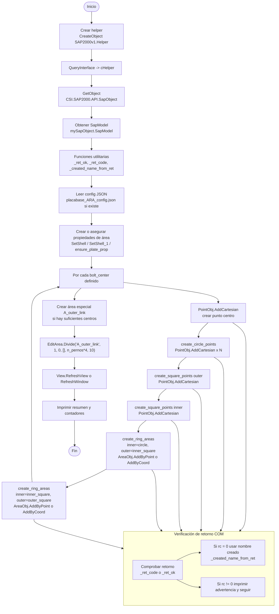

# Diagrama de flujo: placabase_ARA.py — Interacción con API SAP2000

El siguiente diagrama muestra el flujo principal de llamadas a la API de SAP2000 desde `placabase_ARA.py`, incluyendo puntos de decisión (verificación de retorno), intentos de variantes de firma COM y bucles por centros de pernos.

**Mapa rápido de funciones a nodos del diagrama**

- **Conexión y modelo:** `helper = CreateObject(...)`, `helper.QueryInterface(...)`, `helper.GetObject(...)` → nodo `H`, `Q`, `G`, `SM`.
- **Utilidades:** `_ret_ok`, `_ret_code`, `_created_name_from_ret` → nodo `UT` y `CheckRet`.
- **Configuración:** lectura de `placabase_ARA_config.json` → `CFG`.
- **Propiedades de área:** `ensure_plate_prop`, `PropArea.SetShell`, `PropArea.SetShell_1` → `PROP` y `Fallbacks`.
- **Puntos y áreas:** `PointObj.AddCartesian`, `create_circle_points`, `create_square_points`, `AreaObj.AddByPoint`, `AreaObj.AddByCoord` → `AddCenter`, `CreateCircle`, `CreateOuterSquare`, `RingInner`, `RingOuter`.
- **Edición:** `EditArea.Divide` con múltiples firmas intentadas → `DivideArea`.
- **Interfaz visual:** `SapModel.View.RefreshView`, `SapModel.View.RefreshWindow` → `REF`.
- **Resumen:** `print` finales con contadores → `Summary`.

Si quieres, puedo:

- Generar un PNG/SVG del diagrama (requiere que tengas una herramienta Mermaid instalada localmente o usar un renderer en línea). 
- Añadir más nodos detallando cada intento de firma COM con los argumentos exactos (p.ej. lista completa de `attempts` en `add_area_by_coord`).

Archivo creado: [Placa_Base/docs/placabase_ARA_flow.md](Placa_Base/docs/placabase_ARA_flow.md)
