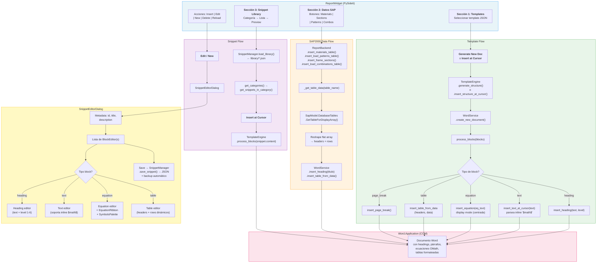

# Reportes — Generador de Memorias de Cálculo

Módulo para generar **memorias de cálculo profesionales en Microsoft Word** integrando templates JSON, datos en vivo de SAP2000 y una librería de snippets con editor de ecuaciones **UnicodeMath**.

## Descripción

### Características Clave

1. **Templates Inteligentes** — Genera la estructura completa del documento (portada, capítulos) con un clic desde archivos JSON en `templates/`.
2. **Conexión en Vivo con SAP2000** — Extrae tablas (Materiales, Patrones, Secciones, Combinaciones) al instante e inserta en Word.
3. **Librería de Snippets** — Base de datos de párrafos y fórmulas reutilizables en `library/*.json`.
4. **Editor de Ecuaciones Nativo** — Escribe fórmulas matemáticas complejas usando sintaxis UnicodeMath con ribbon visual, renderizadas nativamente en Word.

## Arquitectura

| Archivo | Clase | Responsabilidad |
|---|---|---|
| `word_service.py` | `WordService` | Conexión COM a `Word.Application` — insert heading, text (con inline math `$...$`), equation (display), table, page break |
| `report_backend.py` | `ReportBackend` | Extrae datos de SAP2000 vía `DatabaseTables` y los inserta en Word como tablas formateadas |
| `snippet_manager.py` | `SnippetManager` | CRUD de snippets JSON — load, save, delete con backups automáticos en `library/.backups/` |
| `template_engine.py` | `TemplateEngine` | Procesa templates JSON → Word: itera blocks y despacha a `WordService` por tipo |
| `equation_translator.py` | `UnicodeMathBuilder` | Construye expresiones UnicodeMath programáticamente + validate + expand_symbols |
| `equation_translator.py` | Constantes | `UNICODEMATH_SYMBOLS` (~100+), `SYMBOLS_PALETTE`, `EQUATION_TEMPLATES` (NCh, LRFD, etc.) |
| `snippet_editor.py` | `SnippetEditorDialog` | Editor completo por bloques con `BlockEditor` type-specific + `EquationRibbon` |
| `report_gui.py` | `ReportWidget` | GUI principal — 3 secciones: templates, datos SAP, snippet library |

### Estructura de archivos de datos

```
Reportes/
├── library/                    # Snippets JSON
│   ├── 01_casos_de_carga.json
│   ├── 02_Combinaciones.json
│   ├── 03_Informe_Acero.json
│   ├── 04_Informe_Fundacion.json
│   └── .backups/               # Backups automáticos
├── templates/                  # Templates de estructura
│   ├── estructura_acero.json
│   ├── estructura_fundacion.json
│   └── reporte_estandar.json
└── tests/                      # 9 test files
```

## Diagrama de Procedimiento



### Detalle de los 3 flujos principales

#### 1. Template Flow
1. El usuario selecciona un template JSON (`templates/*.json`) que define la estructura del informe.
2. `TemplateEngine.generate_structure()` crea un nuevo documento Word y procesa cada block del template.
3. `process_blocks()` despacha por tipo: `heading` → `insert_heading()`, `text` → `insert_text_at_cursor()` (parsea `$...$` como inline math), `equation` → `insert_equation()` (display OMath centrado), `table` → `insert_table_from_data()`, `page_break` → `insert_page_break()`.

#### 2. SAP2000 Data Flow
1. El usuario hace clic en un botón de datos (Materials, Sections, Patterns, Combos).
2. `ReportBackend` llama `_get_table_data()` → `SapModel.DatabaseTables.GetTableForDisplayArray()` que retorna un flat array.
3. El flat array se reestructura en headers + rows y se inserta como tabla Word formateada en la posición del cursor.

#### 3. Snippet Flow
1. `SnippetManager` carga todos los JSON de `library/` al iniciar.
2. El usuario navega por categorías, selecciona un snippet y hace clic en **"Insert at Cursor"**.
3. Los blocks del snippet se procesan igual que los templates vía `process_blocks()`.
4. Para editar o crear: `SnippetEditorDialog` ofrece un editor por bloques con editores especializados por tipo.

## Interfaz Principal

La pestaña **"Memorias (Word)"** se divide en tres secciones:

### 1. Generar Estructura Base
Selecciona un **Template** (`.json`) y haz clic en **"Generar Documento Nuevo"**. Esto abrirá Word y creará el esqueleto del informe.

### 2. Datos desde SAP2000
Botones rápidos para insertar tablas extraídas del modelo activo:
- **Materiales** — Propiedades de materiales
- **Secc. Frame** — Perfiles utilizados
- **Patrones Carga** — Definiciones de carga estática
- **Combinaciones** — Combos de diseño

> La inserción ocurre en la posición actual del cursor en Word.

### 3. Librería de Contenido (Snippets)
- **Categoría** → filtra (ej: "Cargas Estáticas", "Diseño Sísmico")
- **Lista** → selecciona snippet → preview
- **Insert / Edit / New / Delete / Reload** → gestión completa

## Editor de Snippets y Ecuaciones

### Tipos de Block

| Tipo | Descripción |
|---|---|
| **Heading** | Títulos y subtítulos (Levels 1–6) |
| **Text** | Párrafos normales. Tip: ecuaciones inline con `$...$` |
| **Equation** | Fórmulas centradas (display mode) |
| **Table** | Tablas con headers y filas dinámicas |

### Equation Ribbon

Barra de herramientas visual para insertar estructuras matemáticas:

- **Estructuras** — Fracciones, Raíces, Potencias, Paréntesis
- **Cálculo** — Sumatorias, Integrales, Límites
- **Operadores** — Símbolos de relación, flechas, lógica
- **Matrices** — Plantillas para matrices, vectores, sistemas de ecuaciones

### Sintaxis UnicodeMath

El sistema usa **UnicodeMath** (estándar nativo de Word):

| Estructura | Código | Resultado |
|---|---|---|
| Fracción | `(a)/(b)` | $\frac{a}{b}$ |
| Raíz | `\sqrt(x)` o `√(x)` | $\sqrt{x}$ |
| Potencia | `x^2` | $x^2$ |
| Subíndice | `x_i` | $x_i$ |
| Matriz | `\matrix(1&0@0&1)` | $\begin{pmatrix}1&0\\0&1\end{pmatrix}$ |
| Griega | `\alpha`, `\beta`, `\Sigma` | $\alpha, \beta, \Sigma$ |

> El módulo `equation_translator.py` contiene `UNICODEMATH_SYMBOLS` (~100+ mapeos), `EQUATION_TEMPLATES` con fórmulas NCh/LRFD predefinidas, y la clase `UnicodeMathBuilder` para construcción programática.

## Gestión de Archivos

- **Librería**: `Reportes/library/*.json` — estructura `{category, snippets: [{id, title, description, content: [blocks]}]}`
- **Templates**: `Reportes/templates/*.json` — estructura de documento completa
- **Backups**: Antes de modificar o eliminar, el sistema crea copia en `Reportes/library/.backups/`

## Ejecución Standalone

Este módulo **no tiene** bloque `if __name__ == "__main__"` — solo es accesible vía la aplicación principal:

```bash
python main_app.py
# → Pestaña "Memorias (Word)"
```

## Dependencias

- `comtypes` (COM: `Word.Application` + API SAP2000)
- `PySide6` (GUI)
- `json`, `glob`, `re`, `os`, `tempfile` (gestión de archivos)
- `logging` (diagnóstico)

## Tests

9 archivos de test en `tests/`:

```bash
python -m pytest Reportes/tests/
```
