# Utilidades de Modelado

Colección de herramientas auxiliares para modelado en SAP2000: definición de **secciones frame de acero**, generador de **malla rectangular**, generador de **malla con hueco** (transición de formas), visor de **Database Tables**, visor de **notas Markdown** y **graficador de resultados del Section Designer**.

## Descripción

Agrupa 6 utilidades independientes en sub-pestañas:

| Sub-tab | Utilidad |
|---|---|
| **Frames** | Define secciones de acero por tipo, calcula propiedades, clasifica esbeltez AISC 360-16 e importa a SAP2000 |
| **Malla Rectangular** | Genera una grilla n×m de shell areas en cualquier plano (XY/XZ/YZ) |
| **Malla con Hueco** | Crea transiciones geométricas entre formas (circle/square) mediante anillos concéntricos interpolados |
| **Database Tables** | Consulta y muestra cualquier tabla de la base de datos interna de SAP2000 con filtros por load case/combo |
| **Notas** | Renderiza el archivo `Notas/Notas.md` como referencia técnica rápida |
| **SD Graficos** | Grafica datos del Section Designer: curvas Momento-Curvatura y diagramas de interacción P-M2-M3 (2D/3D) |

## Arquitectura

| Archivo | Clase | Responsabilidad |
|---|---|---|
| `utils_backend.py` | `SapUtils` | Backend unificado — mesh generation, coordinate queries, database table extraction |
| `utils_backend.py` | `SteelSectionCalc` | Cálculo de propiedades geométricas de secciones de acero (A, Ix, Iy, Sx, Sy, Zx, Zy, rx, ry, J, Cw) |
| `utils_backend.py` | `SlendernessClassifier` | Clasificación de esbeltez AISC 360-16 (Tabla B4.1) |
| `app_utils_gui.py` | `parse_pasted_data()` | Helper para parsear datos tabulados (CSV/TSV) con conversión de decimales europeas |
| `app_utils_gui.py` | `MeshUtilsWidget` | Container principal con `QTabWidget` de 6 sub-tabs |
| `app_utils_gui.py` | `FrameSectionWidget` | Inputs dinámicos de sección, selección de material, cálculo, clasificación e importación a SAP2000 |
| `app_utils_gui.py` | `SectionPreviewWidget` | Canvas `QPainter` para vista previa en tiempo real de la sección transversal |
| `app_utils_gui.py` | `RectangularMeshWidget` | Inputs + preview para malla rectangular |
| `app_utils_gui.py` | `HoleMeshWidget` | Inputs + preview para malla con hueco |
| `app_utils_gui.py` | `ResultsTableWidget` | Selector de tabla + filtros + `QTableWidget` de resultados |
| `app_utils_gui.py` | `NotesWidget` | `QTextBrowser` con rendering Markdown |
| `app_utils_gui.py` | `SDGraficosWidget` | Container con QTabWidget de graficadores (Momento-Curvatura y P-M2-M3) |
| `app_utils_gui.py` | `MomentoCurvaturaWidget` | Graficador Momento vs Curvatura con matplotlib (QSplitter: input | plot) |
| `app_utils_gui.py` | `PMWidget` | Graficador P-M2-M3 2D/3D con matplotlib (selector de tipo de gráfico) |
| `app_utils_gui.py` | `PreviewWidget` | Canvas custom — `draw_rect()` y `draw_hole()` con dimensiones |
| `app_utils_gui.py` | `BaseMeshWidget` | Clase base con UI común (botón generate + log) |
| `app_utils_gui.py` | `CheckableListGroup` | Widget reutilizable — `QListWidget` con checkboxes + Select All/None |

## Diagrama de Procedimiento

```mermaid
flowchart TD
    subgraph Tab0["Sub-tab: Frames"]
        F1["Usuario selecciona tipo de sección:<br/>W, C, L, HSS Rect, HSS Round,<br/>2L, 2C, WT"]
        F2["Inputs dinámicos de dimensiones<br/>según SECTION_TYPES"]
        F3["Selecciona material:<br/>preset STEEL_MATERIALS o<br/>materiales del modelo SAP2000"]
        F4["SectionPreviewWidget (QPainter)<br/>muestra sección en tiempo real"]
        F5["<b>Calcular</b> propiedades"]
        F6["SteelSectionCalc<br/>A, Ix, Iy, Sx, Sy, Zx, Zy, rx, ry, J, Cw"]
        F7["SlendernessClassifier<br/>AISC 360-16 Tabla B4.1"]
        F8["Tabla de clasificación<br/>con codificación por color"]
        F9["<b>Importar a SAP2000</b>"]
        F10["SapUtils.create_frame_section()<br/>PropFrame API"]
        F11["<b>Copiar resultados</b><br/>al portapapeles"]
    end

    subgraph Tab1["Sub-tab: Malla Rectangular"]
        R1["Usuario ingresa:<br/>Width, Length, nx, ny,<br/>Origin (x,y,z), Plane, Prop"]
        R1B["Opcional: <b>Get Coordinates</b><br/>lee punto seleccionado<br/>en SAP2000"]
        R2["PreviewWidget.draw_rect()<br/>dibuja grilla con dimensiones"]
        R3["<b>Generate Mesh</b>"]
        R4["SapUtils.create_mesh_by_coord()"]
        R5["Loop nx × ny:<br/>AreaObj.AddByCoord()<br/>por cada celda"]
    end

    subgraph Tab2["Sub-tab: Malla con Hueco"]
        H1["Usuario selecciona:<br/>Outer shape + dim<br/>Inner shape + dim<br/>Angular / Radial divs"]
        H2["PreviewWidget.draw_hole()<br/>dibuja anillos concéntricos"]
        H3["<b>Generate Mesh</b>"]
        H4["SapUtils.create_hole_mesh()"]
        H5["_get_shape_coords_2d()<br/>inner + outer contours"]
        H6["Interpolar anillos<br/>concéntricos radiales"]
        H7["Loop angular × radial:<br/>create_area_by_points()<br/>→ AreaObj.AddByPoint()"]
    end

    subgraph Tab3["Sub-tab: Database Tables"]
        T1["<b>Refresh</b> → get_available_tables()<br/>DatabaseTables.GetAllTablesQuery()"]
        T2["Seleccionar tabla<br/>+ check load cases/combos"]
        T3["<b>Load Table</b>"]
        T4["SapUtils.get_table_data()"]
        T5["DatabaseTables<br/>.GetTableForDisplayArray()"]
        T6["Reshape flat array<br/>→ headers + rows"]
        T7["QTableWidget muestra<br/>resultados tabulares"]
    end

    subgraph Tab4["Sub-tab: Notas"]
        N1["Carga Notas/Notas.md"]
        N2["QTextBrowser.setMarkdown()"]
    end

    subgraph Tab5["Sub-tab: SD Graficos"]
        SD1["Usuario pega datos tabulados<br/>desde Section Designer"]
        SD2["parse_pasted_data()<br/>detecta separador (tab/coma)<br/>convierte decimales europeas"]
        SD3{"Tipo de datos"}
        SD4["MomentoCurvaturaWidget<br/>Requiere: Curvature, Moment"]
        SD5["PMWidget<br/>Requiere: P, M2, M3"]
        SD6["Seleccionar tipo de gráfico:<br/>P vs M2, P vs M3,<br/>M2 vs M3, 3D P-M2-M3"]
        SD7["matplotlib FigureCanvas<br/>plot 2D o 3D"]
        SD8["NavigationToolbar<br/>zoom, pan, save PNG"]
        SD9["QTableWidget muestra<br/>datos parseados"]
    end

    subgraph SAP["SAP2000 API"]
        COORD["SelectObj.GetSelected()<br/>PointObj.GetCoordCartesian()"]
        MAT["PropMaterial.GetNameList()<br/>+ GetTypeOAPI()"]
        FRAME["PropFrame.SetISection / SetChannel / SetAngle<br/>SetTube / SetPipe / SetDoubleAngle / SetDoubleChannel / SetTee"]
    end

    F1 --> F2 --> F4
    F3 --> F4
    F2 --> F5 --> F6 --> F7 --> F8
    F3 --> F9 --> F10
    F10 --> FRAME
    MAT --> F3
    F8 --> F11

    R1 --> R2
    R1 --> R1B --> COORD
    COORD -->|"(x, y, z)"| R1
    R1 --> R3 --> R4 --> R5

    H1 --> H2
    H1 --> H3 --> H4 --> H5 --> H6 --> H7

    T1 --> T2 --> T3 --> T4 --> T5 --> T6 --> T7

    N1 --> N2

    SD1 --> SD2 --> SD3
    SD3 -->|"Momento-Curvatura"| SD4 --> SD7
    SD3 -->|"P-M2-M3"| SD5 --> SD6 --> SD7
    SD7 --> SD8
    SD2 --> SD9

    style Tab0 fill:#e3f2fd,stroke:#1565C0
    style Tab1 fill:#e8f4f8,stroke:#2196F3
    style Tab2 fill:#e8f5e9,stroke:#4CAF50
    style Tab3 fill:#fff3e0,stroke:#FF9800
    style Tab4 fill:#f3e5f5,stroke:#9C27B0
    style Tab5 fill:#fce4ec,stroke:#E91E63
    style SAP fill:#ffebee,stroke:#C62828
```



### Detalle por herramienta

#### Frames
1. El usuario elige el tipo de perfil (`W`, `C`, `L`, `HSS Rect`, `HSS Round`, `2L`, `2C`, `WT`) y el formulario habilita dinámicamente las dimensiones requeridas según `SECTION_TYPES`.
2. Selecciona material desde presets (`STEEL_MATERIALS`: A36, A572 Gr50, A992, A500 Gr B/C) o desde materiales de acero existentes en SAP2000 mediante `get_steel_materials()`.
3. `SectionPreviewWidget` renderiza la geometría con `QPainter` en tiempo real conforme cambian las dimensiones.
4. Al calcular, `SteelSectionCalc` obtiene propiedades seccionales (`A`, `Ix`, `Iy`, `Sx`, `Sy`, `Zx`, `Zy`, `rx`, `ry`, `J`, `Cw`).
5. `SlendernessClassifier` evalúa esbeltez por elemento según AISC 360-16 Tabla B4.1 y presenta una tabla codificada por color.
6. El usuario puede importar la sección al modelo usando `create_frame_section()` (API `PropFrame`) y copiar los resultados al portapapeles.

#### Malla Rectangular
1. El usuario define ancho (`width`), largo (`length`), divisiones (`nx`, `ny`), origen, plano de trabajo y propiedad shell.
2. Opcionalmente, puede leer coordenadas de un punto seleccionado en SAP2000 vía `get_selected_point_coords()` → `SelectObj.GetSelected()` + `PointObj.GetCoordCartesian()`.
3. `create_mesh_by_coord()` itera nx×ny celdas, calculando vértices y llamando `AreaObj.AddByCoord()` para cada una.

#### Malla con Hueco
1. Seleccionar forma exterior (circle/square) y dimensión, forma interior y dimensión, cantidad de divisiones angulares y radiales.
2. `create_hole_mesh()` genera coordenadas 2D del contorno exterior e interior vía `_get_shape_coords_2d()`, luego interpola `num_radial` anillos concéntricos entre ambos.
3. Crea paneles cuadriláteros entre anillos consecutivos con `create_area_by_points()`.

#### Database Tables
1. `get_available_tables()` obtiene el listado completo de tablas disponibles vía `DatabaseTables.GetAllTablesQuery()`.
2. El usuario selecciona tabla y filtra por load cases/combos usando `CheckableListGroup`.
3. `get_table_data()` llama `GetTableForDisplayArray()` (retorna flat array) y reestructura en headers + rows para `QTableWidget`.

#### Notas
- Carga y renderiza `Notas/Notas.md` (actualmente contiene referencia AISC 360 Chapter J) en un `QTextBrowser`.

#### SD Graficos

Visualiza resultados del Section Designer de SAP2000 mediante gráficos interactivos con matplotlib.

**Momento-Curvatura:**
1. El usuario copia datos tabulados desde SAP2000 Section Designer (menú contextual → Copy Table).
2. Pega los datos en el campo de texto del widget.
3. `parse_pasted_data()` detecta automáticamente el separador (tab o coma), convierte decimales europeas (`,` → `.`) y valida columnas.
4. Se requieren las columnas `Curvature` y `Moment`.
5. Los datos se muestran en una tabla para validación visual.
6. El gráfico renderiza la curva Momento vs Curvatura con matplotlib (ejes, grid, labels).
7. NavigationToolbar permite zoom, pan y guardar como PNG.

**P-M2-M3:**
1. Proceso similar, pero requiere columnas `P`, `M2` y/o `M3`.
2. Selector de tipo de gráfico: "P vs M2", "P vs M3", "M2 vs M3" (2D), "3D P-M2-M3" (3D).
3. Para gráfico 3D, matplotlib usa `projection='3d'` con visualización interactiva.
4. Útil para verificar diagramas de interacción y capacidad de secciones.

**Archivo de ejemplo:** `M_Curvatura.txt` contiene datos de referencia para testing.

## Uso en la GUI

La pestaña **"Utilidades de Modelado"** en `main_app.py` presenta las 6 sub-pestañas. Cada herramienta de mesh incluye un preview en vivo que se actualiza al cambiar los parámetros. La pestaña **SD Graficos** permite visualizar resultados del Section Designer sin necesidad de conexión activa a SAP2000.

## Ejecución Standalone

```bash
# GUI con las 5 sub-tabs (conecta vía GetActiveObject)
python Utilidades_MOD/app_utils_gui.py
```

## Infraestructura Utilizada

- **StyledButton** — Botones de generación y consulta (primary, secondary)
- **LogWidget** — Log de operaciones con timestamp
- **check_ret_code** — Validación de retornos API SAP2000
- **AppLogger** — Logging en backend

## Ejecutar Standalone

```bash
python -m Utilidades_MOD.app_utils_gui
```

## Dependencias

- `comtypes` (API SAP2000)
- `PySide6` (GUI)
- `matplotlib` (gráficos Section Designer — opcional pero recomendado)
- `math` (geometría)
- `os` (paths)
