# Utilidades de Modelado

Colección de herramientas auxiliares para modelado en SAP2000: generador de **malla rectangular**, generador de **malla con hueco** (transición de formas), visor de **Database Tables** y visor de **notas Markdown**.

## Descripción

Agrupa 4 utilidades independientes en sub-pestañas:

| Sub-tab | Utilidad |
|---|---|
| **Malla Rectangular** | Genera una grilla n×m de shell areas en cualquier plano (XY/XZ/YZ) |
| **Malla con Hueco** | Crea transiciones geométricas entre formas (circle/square) mediante anillos concéntricos interpolados |
| **Database Tables** | Consulta y muestra cualquier tabla de la base de datos interna de SAP2000 con filtros por load case/combo |
| **Notas** | Renderiza el archivo `Notas/Notas.md` como referencia técnica rápida |

## Arquitectura

| Archivo | Clase | Responsabilidad |
|---|---|---|
| `utils_backend.py` | `SapUtils` | Backend unificado — mesh generation, coordinate queries, database table extraction |
| `app_utils_gui.py` | `MeshUtilsWidget` | Container principal con `QTabWidget` de 4 sub-tabs |
| `app_utils_gui.py` | `RectangularMeshWidget` | Inputs + preview para malla rectangular |
| `app_utils_gui.py` | `HoleMeshWidget` | Inputs + preview para malla con hueco |
| `app_utils_gui.py` | `ResultsTableWidget` | Selector de tabla + filtros + `QTableWidget` de resultados |
| `app_utils_gui.py` | `NotesWidget` | `QTextBrowser` con rendering Markdown |
| `app_utils_gui.py` | `PreviewWidget` | Canvas custom — `draw_rect()` y `draw_hole()` con dimensiones |
| `app_utils_gui.py` | `BaseMeshWidget` | Clase base con UI común (botón generate + log) |
| `app_utils_gui.py` | `CheckableListGroup` | Widget reutilizable — `QListWidget` con checkboxes + Select All/None |

## Diagrama de Procedimiento

```mermaid
flowchart TD
    subgraph Tab1["Sub-tab: Malla Rectangular"]
        R1["Usuario ingresa:<br/>Width, Length, nx, ny,<br/>Origin (x,y,z), Plane, Prop"]
        R1B["Opcional: <b>Get Coordinates</b><br/>lee punto seleccionado<br/>en SAP2000"]
        R2["PreviewWidget.draw_rect()<br/>dibuja grilla con dimensiones"]
        R3["<b>Generate Mesh</b>"]
        R4["SapUtils.create_mesh_by_coord()"]
        R5["Loop nx × ny:<br/>AreaObj.AddByCoord()<br/>por cada celda"]
    end

    subgraph Tab2["Sub-tab: Malla con Hueco"]
        H1["Usuario selecciona:<br/>Outer shape + dim<br/>Inner shape + dim<br/>Angular / Radial divs"]
        H2["PreviewWidget.draw_hole()<br/>dibuja anillos concéntricos"]
        H3["<b>Generate Mesh</b>"]
        H4["SapUtils.create_hole_mesh()"]
        H5["_get_shape_coords_2d()<br/>inner + outer contours"]
        H6["Interpolar anillos<br/>concéntricos radiales"]
        H7["Loop angular × radial:<br/>create_area_by_points()<br/>→ AreaObj.AddByPoint()"]
    end

    subgraph Tab3["Sub-tab: Database Tables"]
        T1["<b>Refresh</b> → get_available_tables()<br/>DatabaseTables.GetAllTablesQuery()"]
        T2["Seleccionar tabla<br/>+ check load cases/combos"]
        T3["<b>Load Table</b>"]
        T4["SapUtils.get_table_data()"]
        T5["DatabaseTables<br/>.GetTableForDisplayArray()"]
        T6["Reshape flat array<br/>→ headers + rows"]
        T7["QTableWidget muestra<br/>resultados tabulares"]
    end

    subgraph Tab4["Sub-tab: Notas"]
        N1["Carga Notas/Notas.md"]
        N2["QTextBrowser.setMarkdown()"]
    end

    subgraph SAP["SAP2000 API"]
        COORD["SelectObj.GetSelected()<br/>PointObj.GetCoordCartesian()"]
    end

    R1 --> R2
    R1 --> R1B --> COORD
    COORD -->|"(x, y, z)"| R1
    R1 --> R3 --> R4 --> R5

    H1 --> H2
    H1 --> H3 --> H4 --> H5 --> H6 --> H7

    T1 --> T2 --> T3 --> T4 --> T5 --> T6 --> T7

    N1 --> N2

    style Tab1 fill:#e8f4f8,stroke:#2196F3
    style Tab2 fill:#e8f5e9,stroke:#4CAF50
    style Tab3 fill:#fff3e0,stroke:#FF9800
    style Tab4 fill:#f3e5f5,stroke:#9C27B0
    style SAP fill:#fce4ec,stroke:#E91E63
```



### Detalle por herramienta

#### Malla Rectangular
1. El usuario define ancho (`width`), largo (`length`), divisiones (`nx`, `ny`), origen, plano de trabajo y propiedad shell.
2. Opcionalmente, puede leer coordenadas de un punto seleccionado en SAP2000 vía `get_selected_point_coords()` → `SelectObj.GetSelected()` + `PointObj.GetCoordCartesian()`.
3. `create_mesh_by_coord()` itera nx×ny celdas, calculando vértices y llamando `AreaObj.AddByCoord()` para cada una.

#### Malla con Hueco
1. Seleccionar forma exterior (circle/square) y dimensión, forma interior y dimensión, cantidad de divisiones angulares y radiales.
2. `create_hole_mesh()` genera coordenadas 2D del contorno exterior e interior vía `_get_shape_coords_2d()`, luego interpola `num_radial` anillos concéntricos entre ambos.
3. Crea paneles cuadriláteros entre anillos consecutivos con `create_area_by_points()`.

#### Database Tables
1. `get_available_tables()` obtiene el listado completo de tablas disponibles vía `DatabaseTables.GetAllTablesQuery()`.
2. El usuario selecciona tabla y filtra por load cases/combos usando `CheckableListGroup`.
3. `get_table_data()` llama `GetTableForDisplayArray()` (retorna flat array) y reestructura en headers + rows para `QTableWidget`.

#### Notas
- Carga y renderiza `Notas/Notas.md` (actualmente contiene referencia AISC 360 Chapter J) en un `QTextBrowser`.

## Uso en la GUI

La pestaña **"Utilidades de Modelado"** en `main_app.py` presenta las 4 sub-pestañas. Cada herramienta de mesh incluye un preview en vivo que se actualiza al cambiar los parámetros.

## Ejecución Standalone

```bash
# GUI con las 4 sub-tabs (conecta vía GetActiveObject)
python Utilidades_MOD/app_utils_gui.py
```

## Infraestructura Utilizada

- **StyledButton** — Botones de generación y consulta (primary, secondary)
- **LogWidget** — Log de operaciones con timestamp
- **check_ret_code** — Validación de retornos API SAP2000
- **AppLogger** — Logging en backend

## Ejecutar Standalone

```bash
python -m Utilidades_MOD.app_utils_gui
```

## Dependencias

- `comtypes` (API SAP2000)
- `PySide6` (GUI)
- `math` (geometría)
- `os` (paths)
